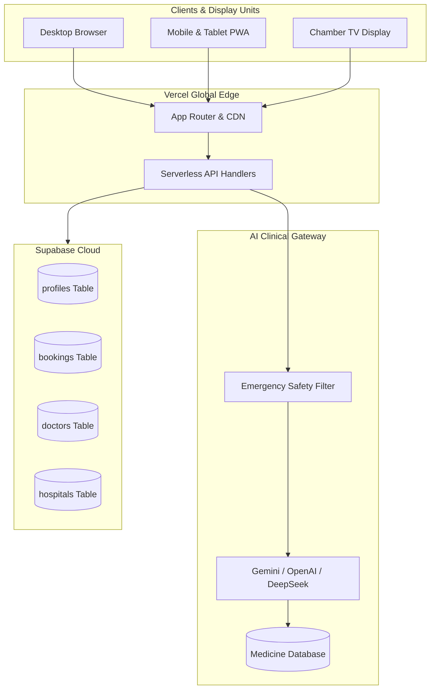
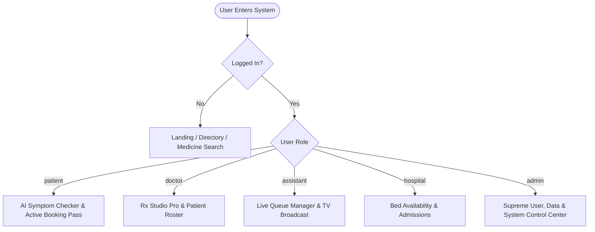
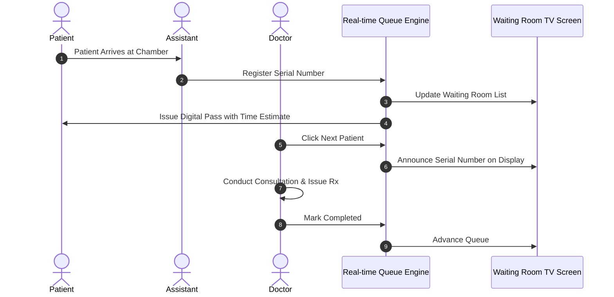
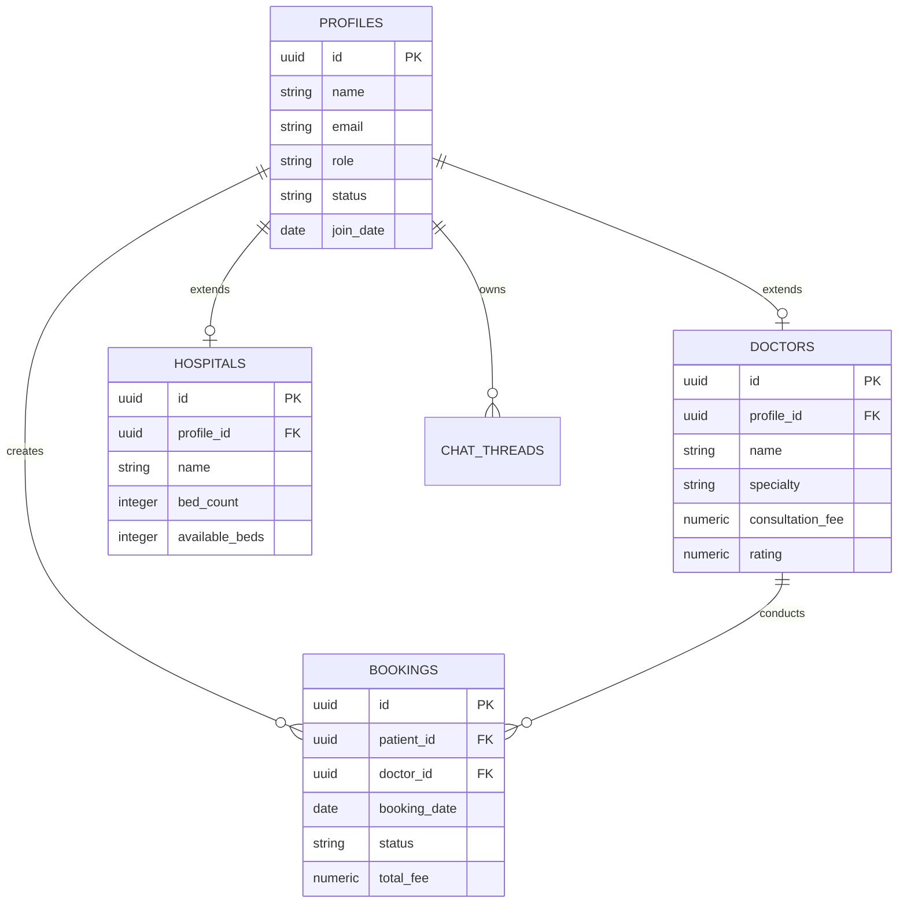

# Platform Visual Architecture

## 1. High-Level Architecture Diagram

```mermaid
graph TB
    subgraph Clients [Clients & Display Units]
        Web[Desktop Browser]
        Mobile[Mobile & Tablet PWA]
        TV[Chamber TV Display]
    end

    subgraph Hosting [Vercel Global Edge]
        EdgeRouter[App Router & CDN]
        APIRoutes[Serverless API Handlers]
    end

    subgraph Intelligence [AI Clinical Gateway]
        Guard[Emergency Safety Filter]
        LLM[Gemini / OpenAI / DeepSeek]
        MedIndex[(Medicine Database)]
    end

    subgraph Storage [Supabase Cloud]
        Profiles[(profiles Table)]
        Bookings[(bookings Table)]
        Doctors[(doctors Table)]
        Hospitals[(hospitals Table)]
    end

    Web --> EdgeRouter
    Mobile --> EdgeRouter
    TV --> EdgeRouter

    EdgeRouter --> APIRoutes
    APIRoutes --> Guard
    Guard --> LLM
    LLM --> MedIndex
    APIRoutes --> Storage
```

## 2. Multi-Role RBAC Flow

```mermaid
flowchart TD
    User([User Enters System]) --> AuthCheck{Logged In?}
    AuthCheck -- No --> PublicPages[Landing / Directory / Medicine Search]
    AuthCheck -- Yes --> RoleSwitch{User Role}

    RoleSwitch -- patient --> PatientConsole[AI Symptom Checker & Active Booking Pass]
    RoleSwitch -- doctor --> DoctorStudio[Rx Studio Pro & Patient Roster]
    RoleSwitch -- assistant --> AssistantDesk[Live Queue Manager & TV Broadcast]
    RoleSwitch -- hospital --> HospitalDesk[Bed Availability & Admissions]
    RoleSwitch -- admin --> SupremeAdmin[Supreme User, Data & System Control Center]
```

## 3. Chamber Queue & TV Display Flow

```mermaid
sequenceDiagram
    autonumber
    actor Patient
    actor Assistant
    actor Doctor
    participant Queue as Real-time Queue Engine
    participant TV as Waiting Room TV Screen

    Patient->>Assistant: Patient Arrives at Chamber
    Assistant->>Queue: Register Serial Number
    Queue->>TV: Update Waiting Room List
    Queue->>Patient: Issue Digital Pass with Time Estimate
    Doctor->>Queue: Click Next Patient
    Queue->>TV: Announce Serial Number on Display
    Doctor->>Doctor: Conduct Consultation & Issue Rx
    Doctor->>Queue: Mark Completed
    Queue->>TV: Advance Queue
```

## 4. Entity Relationship Diagram (ERD)

```mermaid
erDiagram
    PROFILES ||--o| DOCTORS : "extends"
    PROFILES ||--o| HOSPITALS : "extends"
    PROFILES ||--o{ BOOKINGS : "creates"
    DOCTORS ||--o{ BOOKINGS : "conducts"
    PROFILES ||--o{ CHAT_THREADS : "owns"

    PROFILES {
        uuid id PK
        string name
        string email
        string role
        string status
        date join_date
    }

    DOCTORS {
        uuid id PK
        uuid profile_id FK
        string name
        string specialty
        numeric consultation_fee
        numeric rating
    }

    HOSPITALS {
        uuid id PK
        uuid profile_id FK
        string name
        integer bed_count
        integer available_beds
    }

    BOOKINGS {
        uuid id PK
        uuid patient_id FK
        uuid doctor_id FK
        date booking_date
        string status
        numeric total_fee
    }
```
