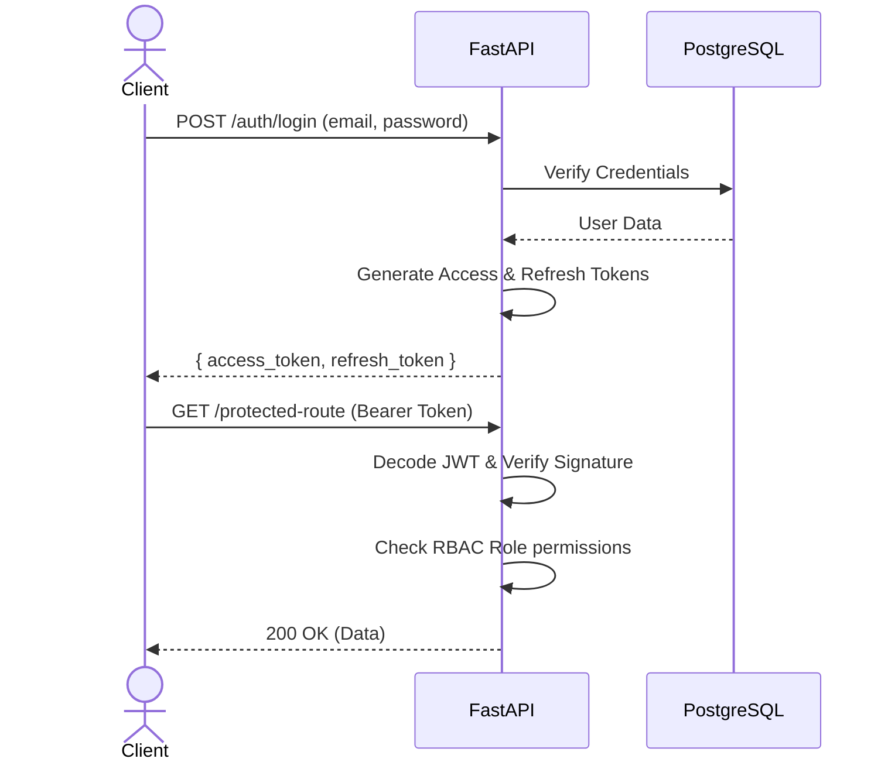

# API Reference

The Oxpecker AI backend exposes a RESTful API built with **FastAPI**. All requests and responses are strictly typed and validated using Pydantic schemas.

## Base URL
All API requests in production should be directed to the API Gateway:
`https://api.oxpecker.ai/v1`

## Authentication

We use JSON Web Tokens (JWT) for stateless authentication. To access protected routes, include the JWT in the `Authorization` header.

```http
Authorization: Bearer <your_access_token>
```

### JWT Validation Flow



## Common Endpoints

### 1. Authentication
- `POST /auth/register` - Create a new user (Patient/Doctor)
- `POST /auth/login` - Authenticate and receive JWT tokens
- `POST /auth/refresh` - Obtain a new access token using a refresh token

### 2. Patients
- `GET /patients/{id}` - Retrieve patient profile
- `GET /patients/{id}/medical-records` - List all lab reports and prescriptions
- `POST /patients/{id}/medical-records` - Upload a new medical record (triggers OCR queue)

### 3. Doctors
- `GET /doctors` - Search doctors (supports filtering by specialty, location)
- `GET /doctors/{id}/slots` - Get available booking slots
- `POST /doctors/{id}/prescriptions` - Create a new digital prescription

## Error Handling

The API returns standard HTTP status codes along with a structured JSON error response.

```json
{
  "error": {
    "code": "VALIDATION_ERROR",
    "message": "Invalid email format",
    "details": [
      {
        "field": "email",
        "issue": "value is not a valid email address"
      }
    ]
  }
}
```

| Code | Description |
| :--- | :--- |
| `400` | Bad Request (e.g., missing required fields) |
| `401` | Unauthorized (Invalid or expired JWT) |
| `403` | Forbidden (User lacks required RBAC role) |
| `404` | Resource Not Found |
| `422` | Unprocessable Entity (Pydantic Validation failed) |
| `500` | Internal Server Error |
