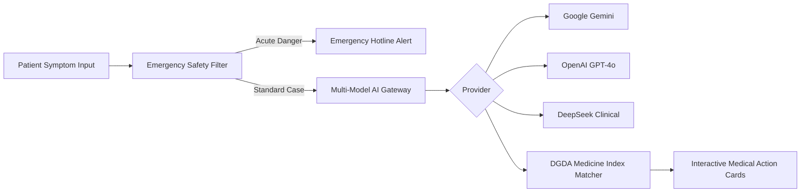

# AI Clinical Intelligence Engine

The Oxpecker AI engine processes patient symptoms, images, and prescriptions while enforcing rigorous safety protocols.

## Clinical Pipeline

## Safety Triage Protocols
1. **Red Flag Detection:** Critical symptoms (e.g., chest pain, stroke symptoms, acute bleeding) trigger immediate emergency card routing with emergency hotline buttons.
2. **Generic Drug Mapping:** AI recommendations are verified against the registered medicine index to prevent hallucinations.
3. **Doctor Verification:** AI outputs explicitly note they do not replace formal medical consultations and recommend verified local specialists.
