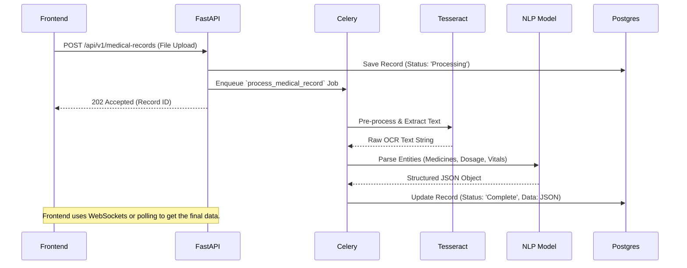

# Optical Character Recognition (OCR)

Shustota AI utilizes an advanced background processing pipeline to convert uploaded handwritten prescriptions and printed lab reports into structured, machine-readable JSON data.

## Workflow Pipeline

Because OCR and NLP processing are computationally expensive and can take several seconds to complete, they cannot block the main FastAPI web thread. Instead, they are processed asynchronously.



## Image Pre-processing

Before the image is fed into the Tesseract OCR engine, it undergoes several OpenCV pre-processing steps in the Celery worker to improve accuracy:
1. **Grayscaling:** Removes color noise.
2. **Binarization:** Converts the image to strict black and white using adaptive thresholding.
3. **Deskewing:** Straightens the document if the photo was taken at an angle.

## Named Entity Recognition (NER)

Once the raw text is extracted, a custom Medical NLP model parses the text to identify specific entities.

**Raw Text Example:**
> "Rx: Napa Extra 500mg, 1-0-1 after meal for 5 days. Blood Pressure 120/80."

**Extracted JSON Structure:**
```json
{
  "vitals": {
    "blood_pressure": "120/80"
  },
  "prescriptions": [
    {
      "medicine_name": "Napa Extra",
      "strength": "500mg",
      "dosage_pattern": "1-0-1",
      "instructions": "after meal",
      "duration": "5 days"
    }
  ]
}
```

## Troubleshooting
- **Accuracy Issues:** Ensure the uploaded image resolution is at least 300 DPI.
- **Timeouts:** If the Celery queue is backed up, start more workers using `celery -A core.worker worker --loglevel=info --concurrency=4`.
