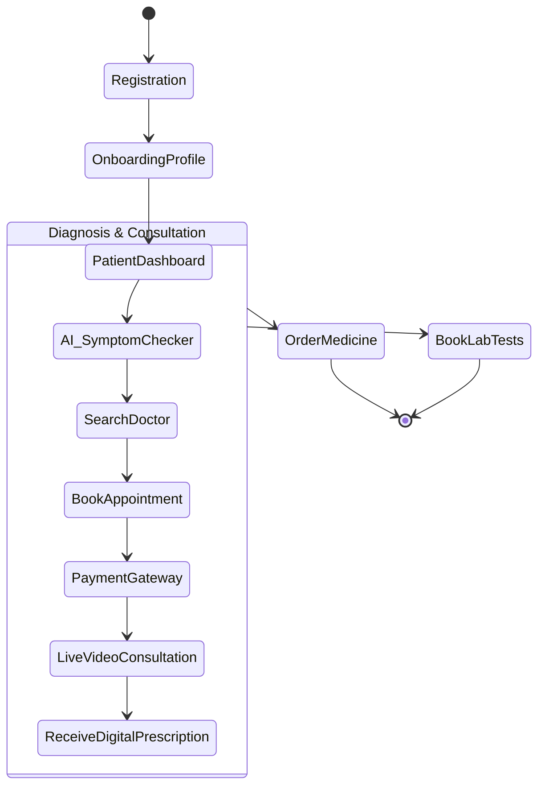

# Patient Journey

The Patient Journey is the core user flow of the platform, guiding a patient from registration through diagnosis, consultation, and treatment.

## End-to-End Workflow

## Step 1: Smart Diagnosis
Instead of blindly searching for a doctor, patients can use the **AI Symptom Checker**. By inputting their symptoms in natural language (e.g., "I have a severe headache and nausea"), the NLP engine suggests the most relevant medical specialties (e.g., Neurology, General Medicine) and recommends top-rated doctors in those fields.

## Step 2: Booking & Payment
Once a doctor is selected, the patient views available time slots. Upon selecting a slot, the system reserves it for 10 minutes and redirects the patient to the SSLCommerz payment gateway. Once payment is confirmed via webhook, the appointment is officially locked and notifications are dispatched.

## Step 3: The Consultation
At the scheduled time, the patient enters the **Live Queue**. When the doctor calls them, a secure **WebRTC Peer-to-Peer Video Call** is established directly within the browser, requiring no external software.

## Step 4: Post-Consultation
Immediately after the call ends, the doctor generates an E-Prescription. A push notification alerts the patient, who can instantly view the prescription PDF, share it, or order the prescribed medicines directly from the platform.
