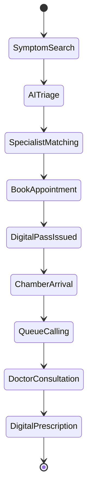

# Patient Journey Workflow

## Key Touchpoints
- **Initial Discovery:** Patient searches symptoms or doctors on the homepage.
- **Smart Booking:** Patient selects a chamber slot and confirms appointment.
- **Live Queue Pass:** Patient monitors real-time queue position on mobile.
- **Consultation & Rx:** Doctor generates digital prescription synced to patient profile.
