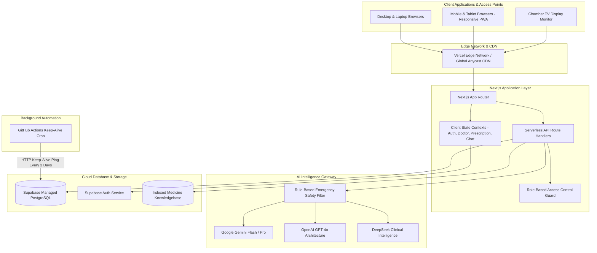
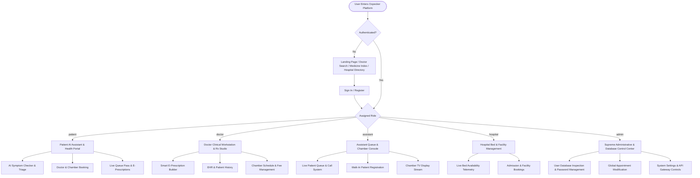
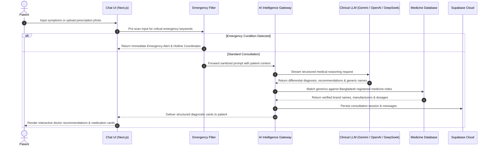
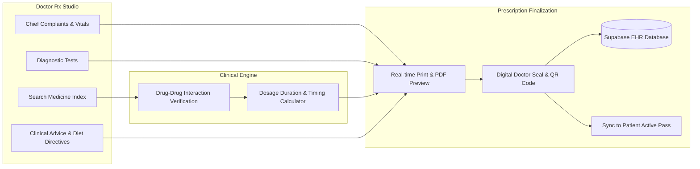
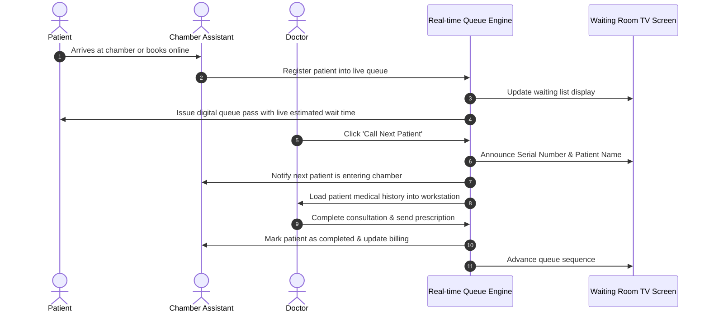
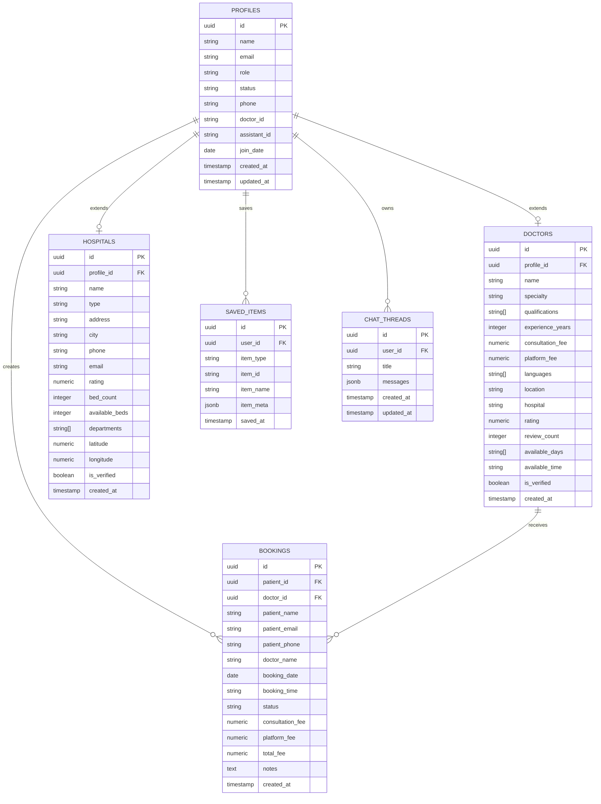
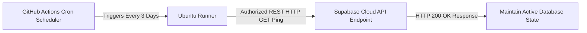

# Oxpecker AI - Next-Generation Intelligent Healthcare Ecosystem

Oxpecker AI is an enterprise-grade healthcare orchestration and clinical intelligence platform built for Bangladesh and emerging healthcare ecosystems. It unites Patients, Doctors, Diagnostic Centers, Hospitals, Clinic Assistants, and System Administrators into a single interconnected network powered by multi-model AI triage, real-time EHR management, and automated chamber queue processing.

Developed by **Team Oxpecker AI** under [EquiSaaS BD](https://equisaas-bd.com).

Live Web Application: [https://oxpecker.equisaas-bd.com](https://oxpecker.equisaas-bd.com)

---

## System Architecture



---

## Role-Based Access Architecture

Oxpecker AI implements strict multi-tenant role-based access control with distinct workflow engines for each medical actor:



---

## AI Clinical Diagnostic & Triage Pipeline

The AI diagnostic engine processes natural language patient inputs, images, and clinical documents while enforcing rigorous safety guardrails:



---

## Smart Prescription & Clinical EMR Studio

Doctors utilize a modular, real-time prescription creation environment with integrated pharmacology intelligence:



---

## Chamber Queue & Live Patient Management Flow

The synchronized triangle between Doctor, Assistant, and Patient for seamless chamber throughput:



---

## Database Schema & Entity Relationship Diagram



---

## Supabase Keep-Alive Automation

Supabase free tier projects pause after inactivity. Oxpecker AI incorporates a zero-cost automated GitHub Action workflow that executes on a schedule to ping the REST endpoint, ensuring uninterrupted production availability:



---

## Core Features & Modules

### Patient Portal
* **Intelligent AI Consultation:** Multimodal symptoms assessment with real-time markdown streaming and dynamic medical action cards.
* **Emergency Response Unit:** Instant triage detection routing acute cases to emergency hospital lines.
* **Doctor Directory & Booking:** Search verified doctors by specialty, division, chamber location, and fees.
* **Interactive Leaflet Maps:** Embedded mapping with geolocation coordinates across Bangladesh hospitals and clinics.
* **Smart Medicine Lookup:** Comprehensive generic, dosage form, manufacturer, and pricing database.
* **Live Appointment Passes:** Real-time queue progress indicators and digital consultation slips.

### Doctor Workstation
* **Clinical Dashboard:** Daily appointment schedule, revenue stats, and patient rosters.
* **Rx Studio Pro:** Rapid prescription generator with generic search, dosage timing, and printable PDF layouts.
* **Patient EMR Viewer:** Longitudinal medical history, past prescriptions, and diagnostic reports.
* **Chamber & Schedule Configurator:** Custom slots, consultation fees, and assistant delegation.

### Assistant Console
* **Chamber Queue Master:** Live patient queue management, calling, and real-time status toggles.
* **Walk-in Registrar:** Rapid intake for non-registered offline patients.
* **Chamber TV Broadcaster:** Dedicated fullscreen display mode for clinic waiting room monitors.

### Hospital Command Center
* **Live Bed & ICU Telemetry:** Track available, occupied, and maintenance beds in real-time.
* **Admission Manager:** Coordinate patient admissions and departmental transfers.

### Supreme Admin Console
* **Global User Governance:** View, create, update credentials, change roles, ban, or delete accounts.
* **Appointment Control:** Full oversight on all platform bookings and fee settlements.
* **Database Direct Sync:** Synchronize client states with Supabase managed PostgreSQL instances.

---

## Technology Stack

| Domain | Technology | Description |
|---|---|---|
| **Framework** | Next.js 15 (App Router) | React Server Components, Serverless Endpoints, Turbopack |
| **UI & Styling** | Tailwind CSS v4, Framer Motion, Lucide | Responsive design system, Spring animations, Light Theme |
| **Database** | PostgreSQL (Supabase) | Row Level Security (RLS), ACID Compliance, Relational Schema |
| **Authentication** | Supabase Auth | Secure JWT session management, RBAC enforcement |
| **Mapping Engine** | Leaflet.js, OpenStreetMap | Lightweight, interactive hospital and clinic mapping |
| **AI Providers** | Google Gemini, OpenAI, DeepSeek | Multi-provider intelligence gateway |
| **Automation** | GitHub Actions | Recurring CI/CD workflows and database keep-alive heartbeat |
| **Hosting** | Vercel | Global CDN deployment and Serverless Edge execution |

---

## Local Development Setup

### Prerequisites
* Node.js v20 or higher
* npm or pnpm

### Installation

```bash
# Clone the repository
git clone https://github.com/EquiSaaS-BD/Oxpecker-AI.git
cd Oxpecker-AI

# Navigate to Frontend directory
cd Frontend

# Install dependencies
npm install

# Start development server
npm run dev
```

The application will be available at `http://localhost:3000`.

---

## Environment Variables Configuration

Create a `.env.local` file inside the `Frontend` directory:

```env
# Supabase Configuration
NEXT_PUBLIC_SUPABASE_URL=https://your-project.supabase.co
NEXT_PUBLIC_SUPABASE_ANON_KEY=your-supabase-anon-key

# AI Gateway API Keys
GOOGLE_GENERATIVE_AI_API_KEY=your-gemini-key
OPENAI_API_KEY=your-openai-key
DEEPSEEK_API_KEY=your-deepseek-key
```

---

## License & Attribution

This project is licensed under the MIT License.

Built with dedication by **Team Oxpecker AI** for [EquiSaaS BD](https://equisaas-bd.com).
