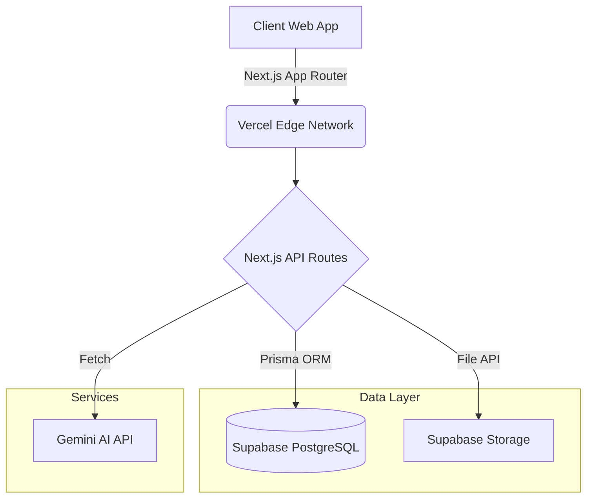
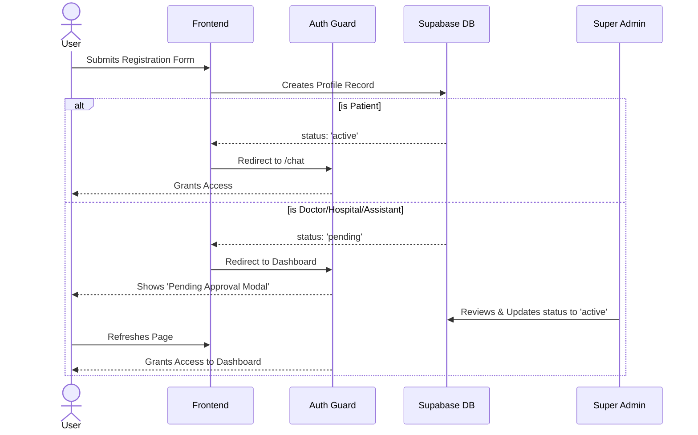
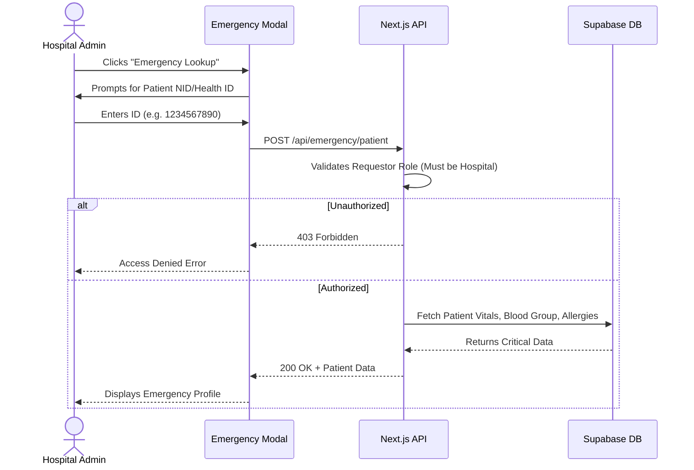
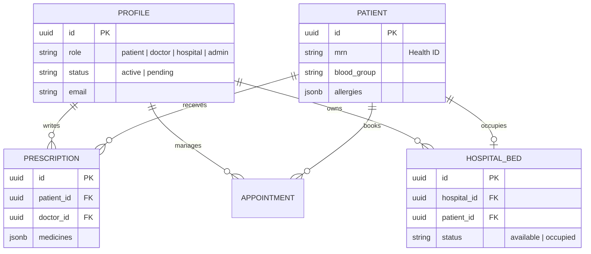
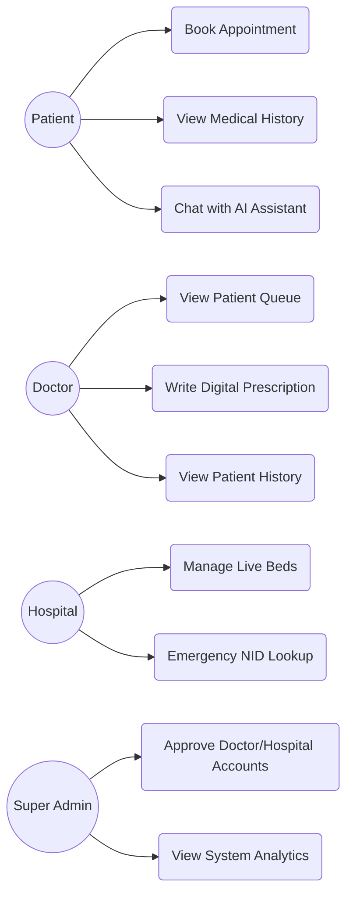

# 🏥 Oxpecker AI (Oxpecker AI)
> A centralized, intelligent healthcare platform connecting patients, doctors, and hospitals.

Oxpecker AI is built to solve fragmented medical records, inefficient serial management, and lack of critical data availability during hospital emergencies. By providing a **Universal Health ID**, patients can carry their entire medical history digitally, while hospitals can access life-saving data instantly during critical admissions.

---

## 🏗️ System Architecture

## 🔄 User Registration & RBAC Flow

## 🚨 Emergency Lookup Flow (Hospital Only)

## 🗄️ Entity Relationship Diagram (Core)

## 🧑‍🤝‍🧑 Use Case Flow

---
*Built securely for the citizens of Bangladesh.*
