# Shustota AI: Enterprise System Architecture Documentation

*This is a living architectural document for Shustota AI. It is being generated in phases.*

---

## 1. Complete High Level Architecture Diagram

The High-Level Architecture outlines the end-to-end ecosystem. Users interact via the Next.js frontend, which connects through an API Gateway to the FastAPI backend. The backend orchestrates tasks between PostgreSQL, Redis, Celery workers, and the AI/ML modules.

```mermaid
graph TD
    %% Styling
    classDef users fill:#3b82f6,stroke:#1e3a8a,stroke-width:2px,color:#fff,font-weight:bold
    classDef frontend fill:#10b981,stroke:#047857,stroke-width:2px,color:#fff
    classDef gateway fill:#8b5cf6,stroke:#5b21b6,stroke-width:2px,color:#fff
    classDef backend fill:#f59e0b,stroke:#b45309,stroke-width:2px,color:#fff
    classDef database fill:#ef4444,stroke:#b91c1c,stroke-width:2px,color:#fff
    classDef cache fill:#ec4899,stroke:#be185d,stroke-width:2px,color:#fff
    classDef ai fill:#0ea5e9,stroke:#0369a1,stroke-width:2px,color:#fff
    classDef external fill:#64748b,stroke:#334155,stroke-width:2px,color:#fff

    %% Nodes
    subgraph Users
        U1(Patient) ::: users
        U2(Doctor) ::: users
        U3(Assistant) ::: users
        U4(Admin) ::: users
    end

    F[Next.js Frontend / Web App] ::: frontend
    AG[API Gateway / Nginx / Load Balancer] ::: gateway

    subgraph Backend Services
        B_CORE[FastAPI Core Backend] ::: backend
        B_AUTH[Auth Service] ::: backend
        B_PAY[Payment Service] ::: backend
        B_NOTIF[Notification Service] ::: backend
    end

    subgraph Data Layer
        DB[(PostgreSQL Database)] ::: database
        REDIS[(Redis Cache / Broker)] ::: cache
        S3[(Cloud Storage / AWS S3)] ::: database
    end

    subgraph Asynchronous Processing
        CELERY[Celery Worker Queue] ::: cache
    end

    subgraph AI & ML Engine
        AI_GATE[AI Gateway] ::: ai
        LLM[Google Gemini / LLM] ::: ai
        OCR[Medical OCR Engine] ::: ai
        ML[Disease Prediction ML] ::: ai
    end

    subgraph External Services
        EXT_PAY[SSLCommerz / Stripe] ::: external
        EXT_SMS[SMS Gateway / Twilio] ::: external
        EXT_RTC[WebRTC / Video Call] ::: external
    end

    %% Connections
    Users -->|HTTPS| F
    F -->|REST API / WSS| AG
    AG --> B_CORE
    AG --> B_AUTH
    
    B_CORE <--> B_PAY
    B_CORE <--> B_NOTIF
    
    B_CORE -->|Read/Write| DB
    B_AUTH -->|Read/Write| DB
    
    B_CORE -->|Cache/Session| REDIS
    B_CORE -->|Enqueue Job| CELERY
    CELERY -->|Pop Job| REDIS
    CELERY -->|Write Result| DB
    
    B_CORE -->|Upload/Download| S3
    
    B_CORE -->|Analyze Data| AI_GATE
    CELERY -->|Background Processing| AI_GATE
    
    AI_GATE --> LLM
    AI_GATE --> OCR
    AI_GATE --> ML
    
    B_PAY -->|Process| EXT_PAY
    B_NOTIF -->|Send| EXT_SMS
    F -->|P2P Video| EXT_RTC
```

---

## 2. Complete Data Flow Diagram (DFD)

This diagram tracks the exact movement of data during a critical operation. Here we illustrate the **Patient Registration & Onboarding** flow.

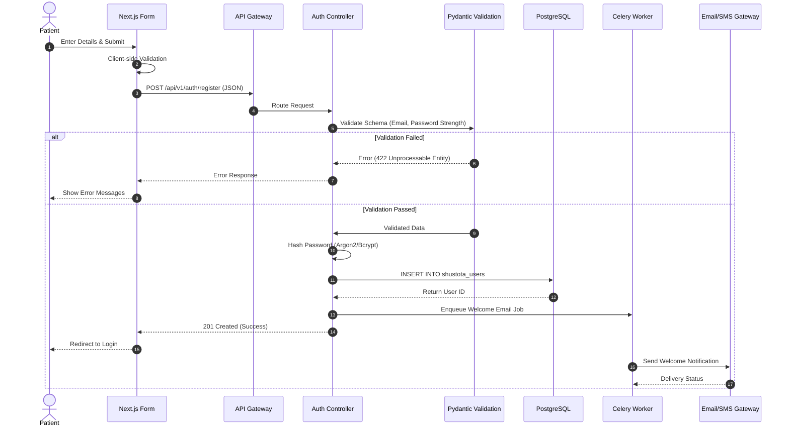

---

## 3. Complete User Flow Diagram

Visualizing the path different user roles take through the application.

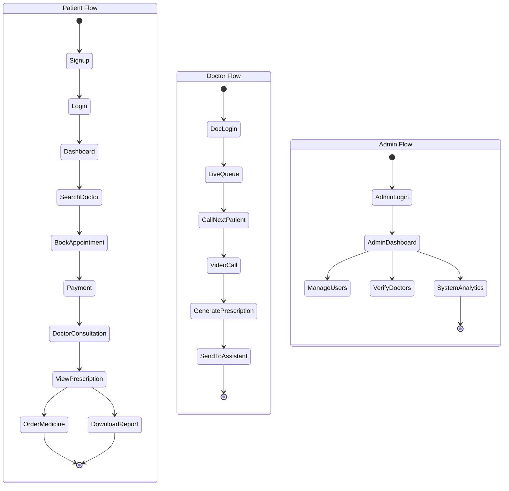

---

## 4. Database Relationship Diagram (ER Diagram)

The underlying schema architecture for Shustota AI. 

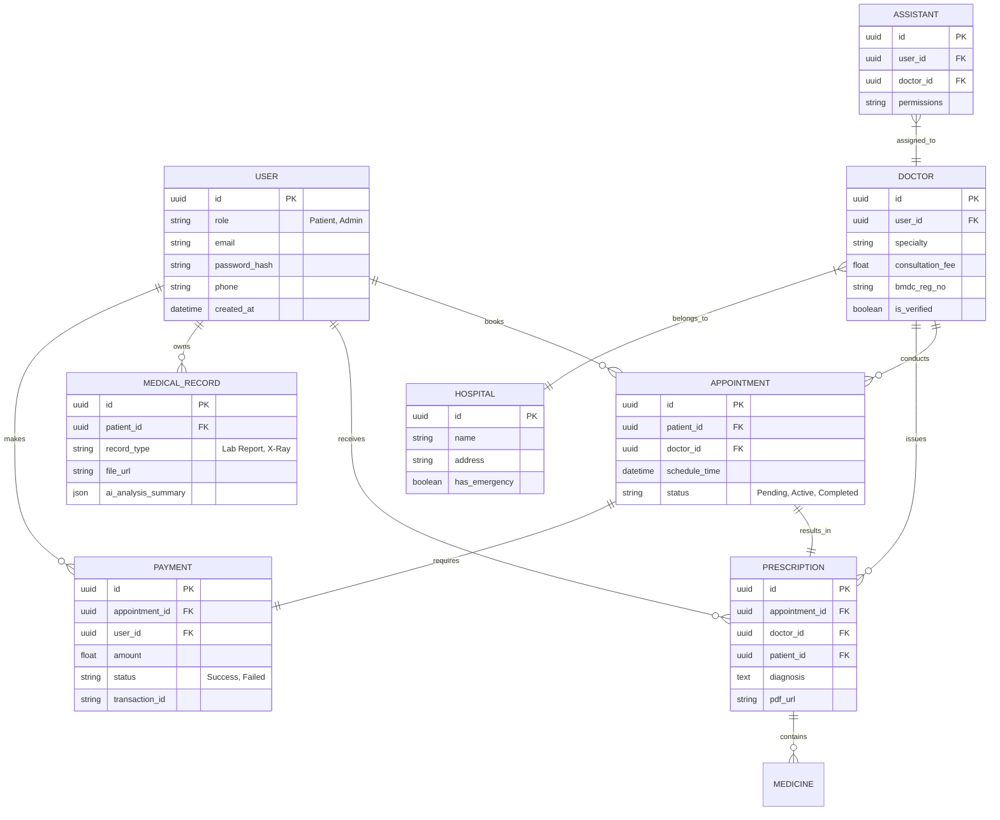

---

## 5. Authentication & Authorization Flow

Demonstrating the robust JWT-based security layer.

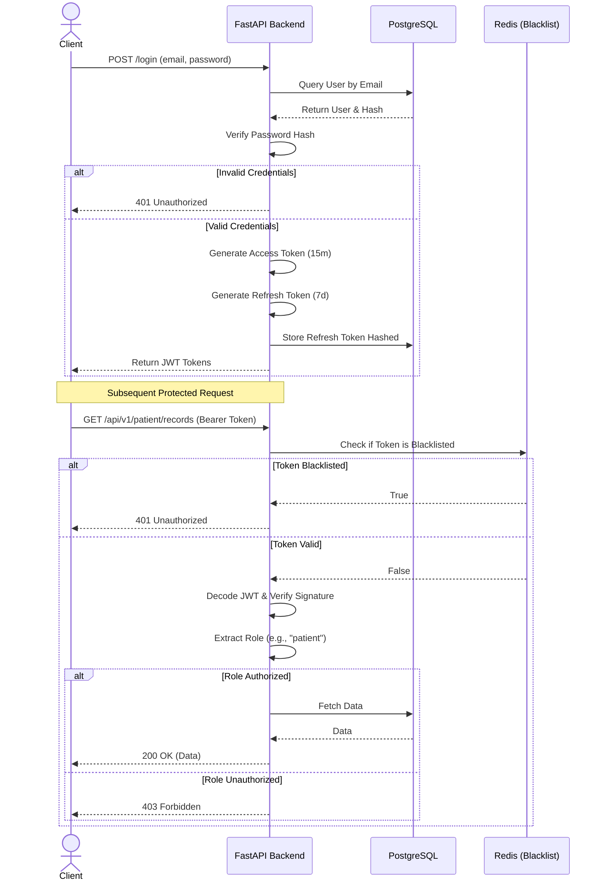

---

## 6. AI Workflow Diagram

Shustota AI integrates advanced machine learning and OCR modules. This diagram illustrates the medical image processing flow, where a patient uploads a lab report.

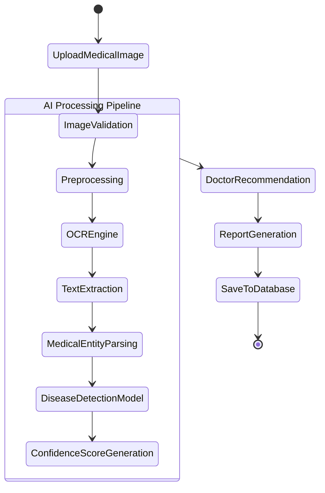

---

## 7. OCR Processing Flow

Detailed breakdown of how the Optical Character Recognition (OCR) engine extracts structured medical data from raw prescriptions and reports.

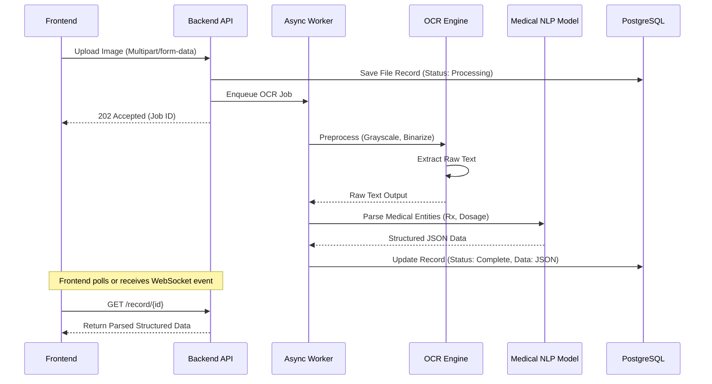

---

## 8. Doctor Appointment Workflow

The end-to-end process of booking and conducting an appointment.

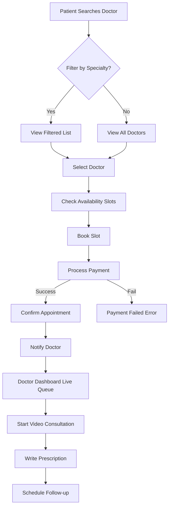
---

## 9. Prescription Workflow

How a prescription moves from the doctor's desk to the patient's records.

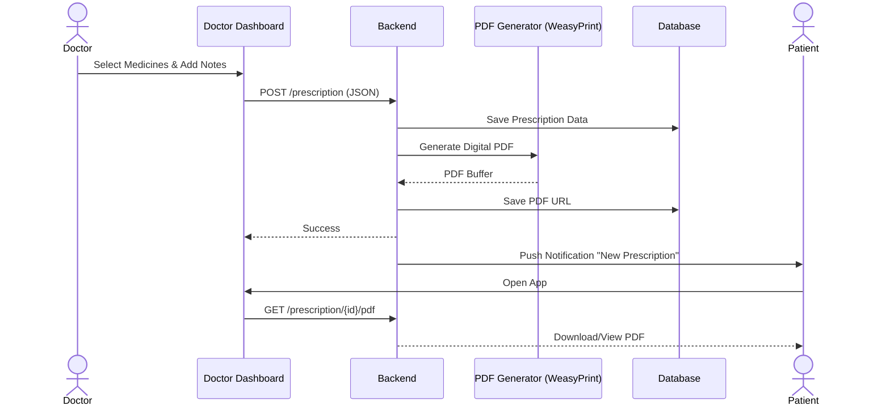

---

## 10. Notification Workflow

Handling system-wide real-time alerts and scheduled messages.

```mermaid
graph LR
    classDef trigger fill:#ef4444,color:#fff
    classDef worker fill:#f59e0b,color:#fff
    classDef delivery fill:#10b981,color:#fff

    T1(Appointment Booked) ::: trigger
    T2(Payment Received) ::: trigger
    T3(Prescription Ready) ::: trigger

    B[FastAPI Backend] 
    Q[(Redis Queue)] 
    W[Celery Notification Worker] ::: worker

    T1 --> B
    T2 --> B
    T3 --> B

    B -->|Enqueue| Q
    Q -->|Pop| W

    W -->|Push| PUSH[FCM / APNS] ::: delivery
    W -->|Email| EMAIL[SendGrid / SMTP] ::: delivery
    W -->|SMS| SMS[Twilio / Local SMS] ::: delivery
```

---

## 11. Payment Workflow

Integrating third-party payment gateways safely.

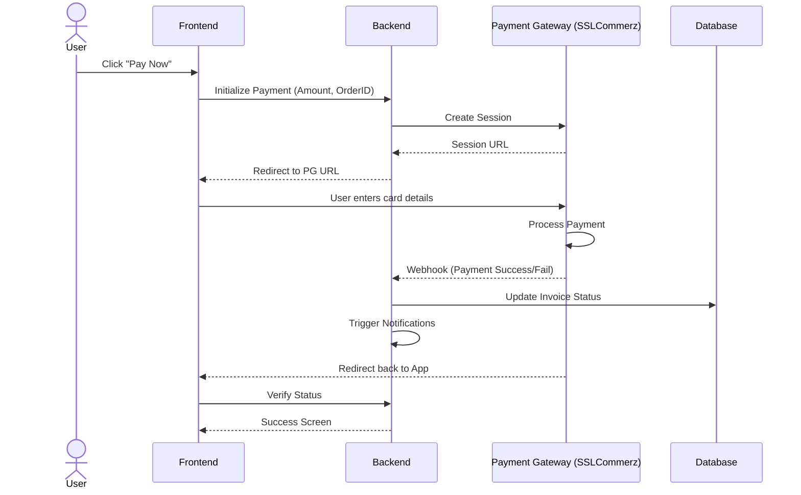

---

## 12. File Upload Workflow

Securely handling medical reports and patient avatars.

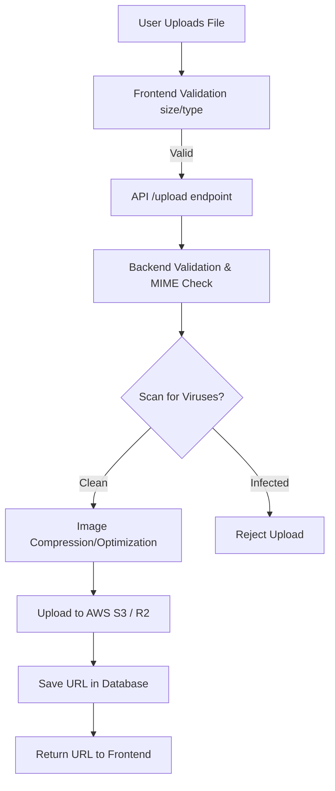

---

## 13. API Communication Diagram

Standard REST API controller and service layer pattern used across all endpoints.

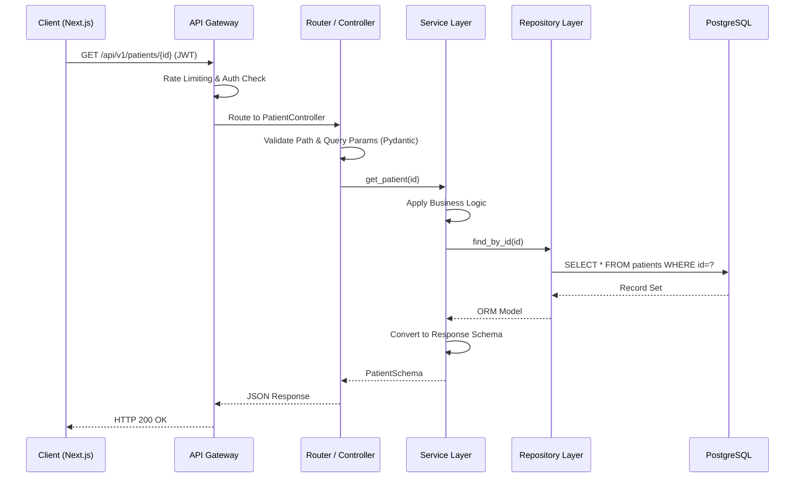

---

## 14. Admin Workflow

How system administrators govern the platform.

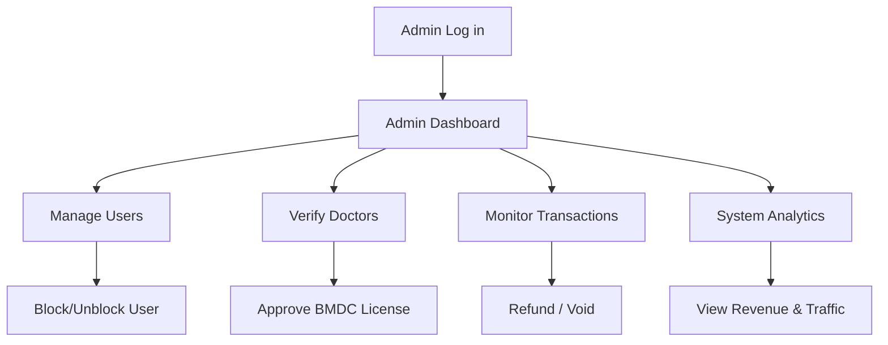

---

## 15. Backend Module Dependency Diagram

Showing the internal structure of the FastAPI backend.

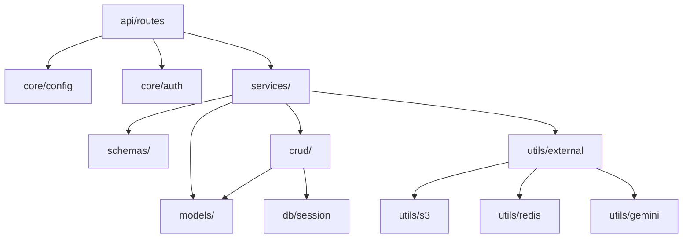

---

## 16. Frontend Component Tree

High-level React component hierarchy for the application.

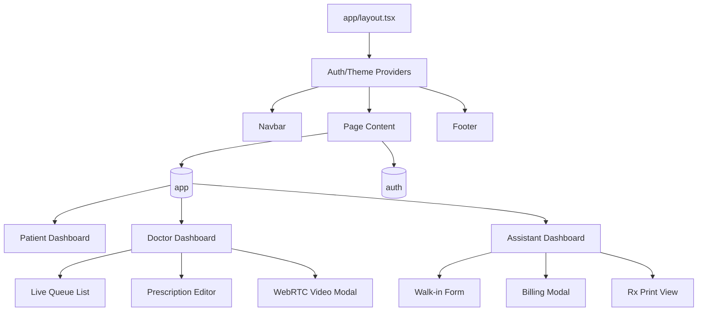

---

## 17. Folder Structure Diagram

The monorepo-style folder architecture for Shustota AI.

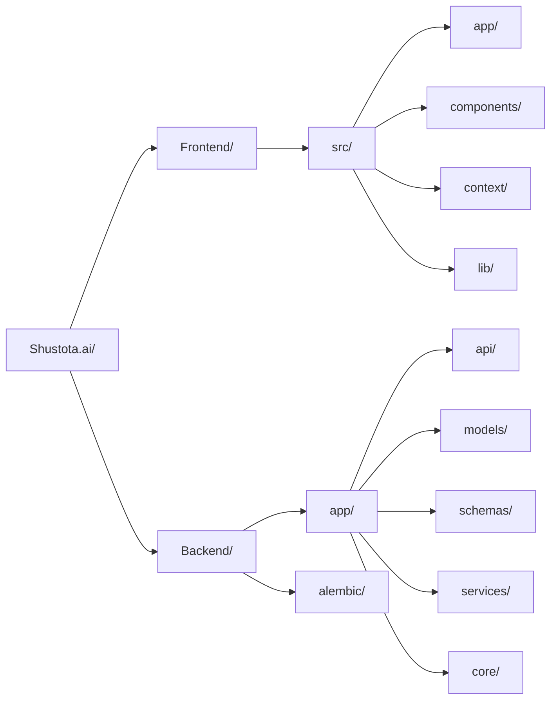

---

## 18. Deployment Architecture

Cloud architecture for enterprise scale and high availability.

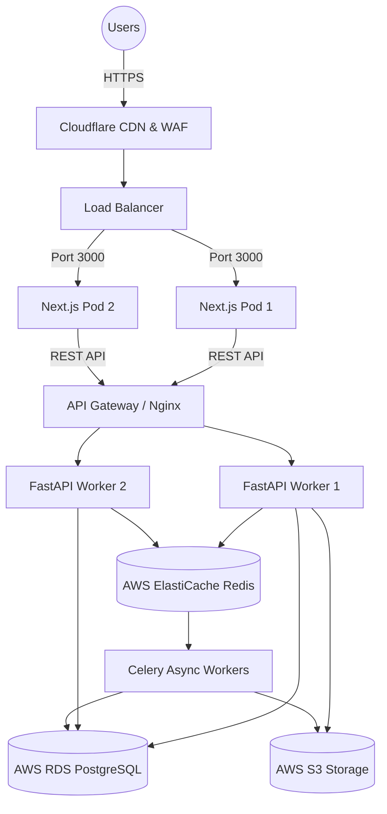

---

## 19. Security Architecture

Multi-layered security protocols ensuring HIPAA/Data compliance.

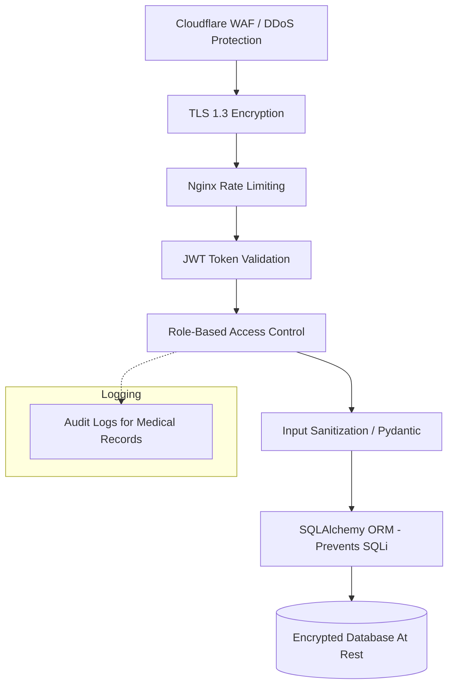
---

## 20. Complete End-to-End System Flow

The grand overview of a user's entire lifecycle through Shustota AI, connecting all major services.

```mermaid
sequenceDiagram
    participant P as Patient
    participant F as Frontend
    participant AG as API Gateway
    participant BE as Core Backend
    participant Q as Redis Queue
    participant W as Celery Workers
    participant AI as AI/OCR Modules
    participant D as Doctor
    
    P->>F: Upload Previous Lab Report
    F->>AG: POST /upload
    AG->>BE: Auth & Store File
    BE->>Q: Enqueue OCR Task
    Q->>W: Pop Task
    W->>AI: Extract Text & Analyze
    AI-->>W: Structured JSON + Disease Prediction
    W->>BE: Save to Database
    BE-->>F: Update UI via WebSocket
    
    P->>F: Book Appointment based on AI Suggestion
    F->>AG: Process Payment
    AG->>BE: Verify SSLCommerz Webhook
    BE->>Q: Enqueue Notifications
    
    Q->>W: Send SMS/Email
    W->>P: "Appointment Confirmed"
    W->>D: "New Patient Scheduled"
    
    D->>F: Start Consultation
    F<-->>F: WebRTC P2P Video Call
    
    D->>F: Generate E-Prescription
    F->>AG: Save & Generate PDF
    AG->>BE: Store & Sign PDF
    BE-->>F: PDF Download Link
    F-->>P: View Prescription
```

---

# Phase 4: System Gap Analysis & Improvement Roadmap

After analyzing the current state of the Shustota AI repository (Next.js Frontend & FastAPI Backend), several critical gaps between the current prototype and an enterprise-scale production environment were identified.

## 1. Identified Architecture Gaps & Missing Modules

### 🔴 Missing Core Infrastructure
- **Redis & Celery Missing:** The architecture diagrams rely on async queues for OCR, Emails, and AI processing, but there is no `docker-compose` configuration or setup for Redis/Celery. Operations currently block the main thread.
- **OCR Engine Not Integrated:** The medical OCR processing flow is mocked. Tesseract/Cloud Vision API integration code is absent.
- **ML Models Missing:** The disease prediction ML module is missing from the Python backend.
- **Cloud Storage (AWS S3):** Files are currently stored locally or in memory. S3 buckets and boto3 integrations are missing.

### 🔴 Security Vulnerabilities
- **RBAC (Role Based Access Control) Weakness:** The FastAPI routes do not systematically enforce `@requires_role(["doctor", "admin"])` decorators.
- **Rate Limiting:** Nginx/Cloudflare and internal FastAPI rate limiting (`slowapi`) are missing, leaving the API vulnerable to DDoS or brute force on the `/login` endpoint.
- **Audit Logs:** There is no centralized audit logging for when doctors view or modify patient medical records (Critical for HIPAA compliance).

### 🟡 Database & Performance Issues
- **Database Migrations (Alembic):** While `alembic` is present, the schema lacks necessary indexing on frequently queried columns (e.g., `user_id` in appointments).
- **Caching:** Expensive AI endpoints and doctor search queries are not cached in Redis.
- **Connection Pooling:** SQLAlchemy `asyncio` is used, but connection pool limits (`pool_size`, `max_overflow`) are not tuned for high concurrency.

### 🟡 UX Flow & Frontend Bottlenecks
- **LocalStorage Reliance:** The frontend currently relies heavily on `localStorage` for mocking state. This needs to be replaced entirely with React Query/SWR fetching from the backend API.
- **WebRTC Implementation:** Video consultation UI exists, but the signaling server (Socket.io/WebSockets) connecting the WebRTC peers is missing.

---

## 2. Architecture Improvement Roadmap

This roadmap prioritizes the tasks required to bring Shustota AI to a production-ready, enterprise scale.

| Priority | Category | Task Description | Impact |
|:---|:---|:---|:---|
| **CRITICAL** | **State Management** | Strip `localStorage` mock data from Next.js and integrate RTK Query or React Query to fetch real data from FastAPI. | System cannot function with real users otherwise. |
| **CRITICAL** | **Authentication** | Enforce JWT validation and RBAC across all FastAPI routes. Implement refresh token rotation. | Prevents unauthorized data access (Data Leak). |
| **CRITICAL** | **Asynchronous Tasks** | Spin up Redis & Celery via Docker. Offload all Email, SMS, and AI processing to Celery workers. | Prevents API timeouts during heavy AI tasks. |
| **HIGH** | **Storage** | Integrate AWS S3 (via `boto3`) for storing prescriptions, user avatars, and lab reports. | Prevents local server disk from filling up. |
| **HIGH** | **AI & OCR** | Implement Tesseract or Google Cloud Vision for real OCR extraction. Create the pipeline to parse medical JSON. | Enables the core USP of Shustota AI. |
| **HIGH** | **Database** | Add compound indexes to PostgreSQL (via Alembic) for optimized search. Implement soft deletes for records. | Massive performance gain at scale. |
| **MEDIUM** | **Security** | Implement FastAPI Rate Limiting, Helmet headers, and CORS restrictions. | Mitigates basic cyber attacks. |
| **MEDIUM** | **Observability** | Integrate Sentry for Error Tracking, and Prometheus/Grafana for monitoring backend health. | Crucial for DevOps maintenance. |
| **LOW** | **Disaster Recovery** | Set up automated daily cron jobs for PostgreSQL database backups (pg_dump) to cold storage. | Ensures business continuity. |

---
**End of Document**
